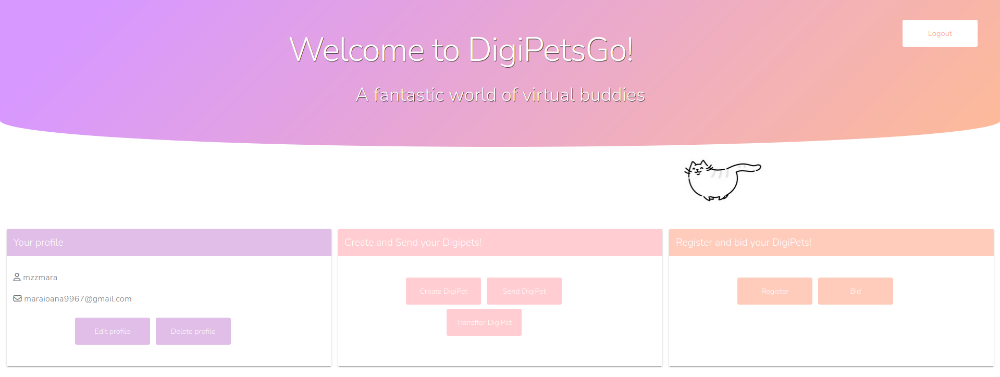

Copyright 2022 Radu Nichita, Mara Nicolae, Cristian Desculțu

# DigiPetsGo

A fantastic world of virtual customizable animals that allows collectors to create, sell and buy unique
animals characters using `Multiversx`.
Users can interact with their friends or players from everywhere in the world to grow their collection of digital friends.

The application promises an easy-to-use design to create unique in-game characters that can be traded with other users.
It is a relaxing activity through which one can unleash their imagination to create the most inventive and goofy characters in the virtual zoo.


## Installation

1. Clone our repository:

   ```console
   $ https://github.com/RaduNichita/fob-project
   ```

1. Run the `install.sh` script (for Debian based distros):


Please open an issue if you feel something is missing from the install script

## How to run:

- start the InfluxDB container separately
    - go the the `./backend` directory and start the container using the `run.sh` script
    - make sure that the container is up and running
    - update the database accordingly if necessary (connect to its shell and follow the *InfluxDB tutorial section*)
- in `./website` directory run : `npm run start`
- to access the frontend, use `localhost:3001`
- remember to do the clean up running `clean.sh`

 


## Team Involvement

[Radu Nichita](https://github.com/RaduNichita]): Implement smart contract

[Mara Nicolae](https://github.com/maranicolae) : Implement frontend and backend

[Cristian Desculțu](https://github.com/HyperSmoit) : Test functionalities + code review + contributions on UI/UX


## Team Difficulties
* Understanding the requirements for the `transactions`

* Getting acustomed to using the `erdpy tools`

* Integrating the `frontend` and `backend` with the `smart contract`

